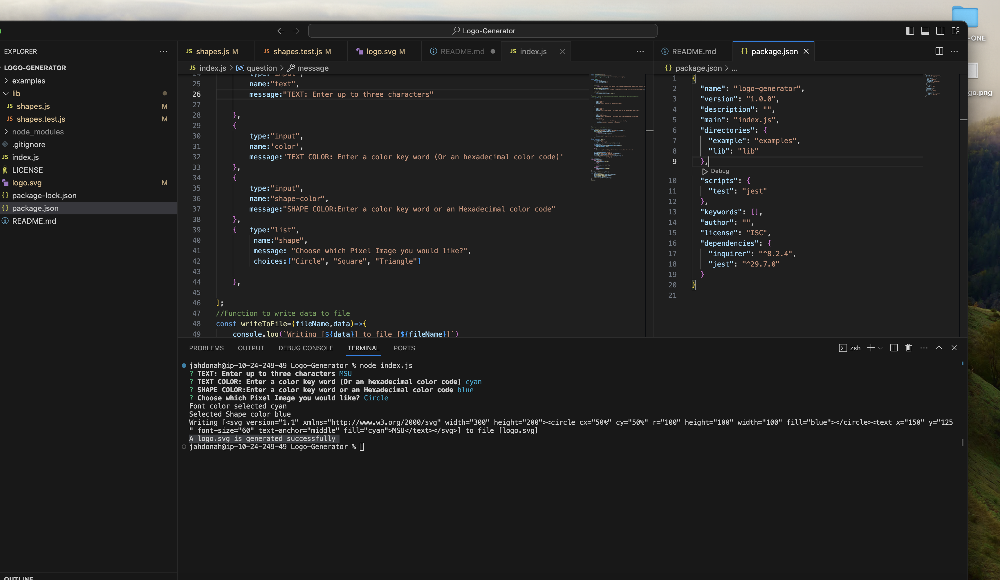
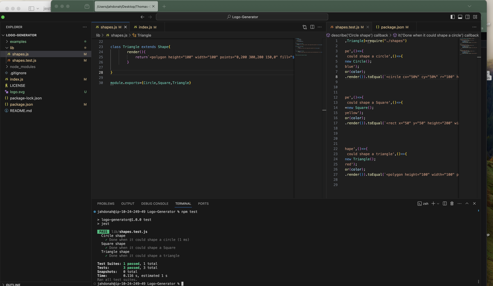
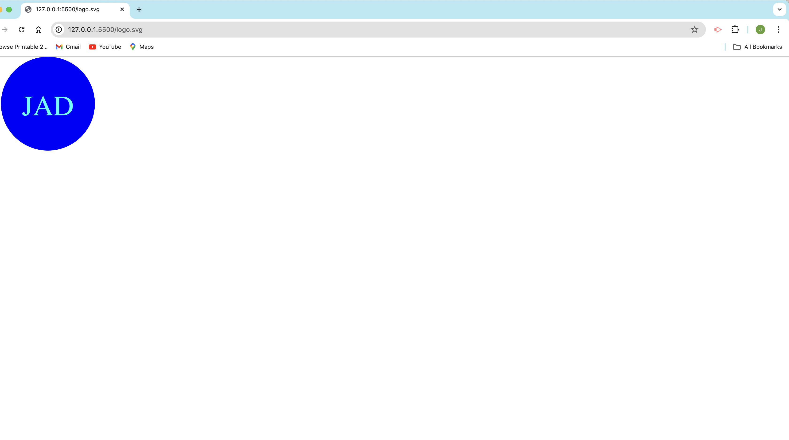

# Logo-Generator


## Description
```md
This is  a Node.js command-line application that takes in user input to generate a logo and save it as an [SVG file](https://en.wikipedia.org/wiki/Scalable_Vector_Graphics). The application prompts the user to select a color and shape, provide text for the logo, and save the generated SVG to a `.svg` file.
```
## Table of Contents

- [Description](#description)
- [Table of Contents](#table-of-contents)
- [Installation](#installation)
- [User Story](#user-story)
- [Acceptance Criteria](#acceptance-criteria)
- [Usage](#usage)

- [Authors and Contributors](#authors-and-contributors)
- [License](#license)
- [Github Repository Link](#github-repository-link)
- [Google Drive Link Hosting the video](#google-drive-link-hosting-the-video)
- [Contact Me](#contact-me)

## Installation
```md
This  Application will be run under the terminal or command prompt. Installation required will be node so that it will allow to run js (Javascript) and so the requirer version 8.2.4. 

```
## User Story

```md
AS A developer
I WANT to generate a simple logo for my projects
SO THAT I don't have to pay a graphic designer
```

## Acceptance Criteria

* GIVEN a command-line application that accepts user input
* WHEN I am prompted for text
* THEN I can enter up to three characters
* WHEN I am prompted for the text color
* THEN I can enter a color keyword (OR a hexadecimal number)
* WHEN I am prompted for a shape
* THEN I am presented with a list of shapes to choose from: circle, triangle, and square
* WHEN I am prompted for the shape's color
* THEN I can enter a color keyword (OR a hexadecimal number)
* WHEN I have entered input for all the prompts
* THEN an SVG file is created named `logo.svg`
AND the output text "Generated logo.svg" is printed in the command line
* WHEN I open the `logo.svg` file in a browser
* THEN I am shown a 300x200 pixel image that matches the criteria I entered

## Usage

```md
Open a terminal or a command prompt, and then using command navigate according to the path and reach to the folder containing the project then open the file by using the following command [node index.js]. Once the node is installed and requirer version 8.2.4 are installed you will be asked to respond to the questions after responding a question press enter to go the next question till the end where successful message of "A logo.svg is generated successfully" will be displayed

```
## Mock Up

The following images show the  application's appearance and functionality:

* The image below shows the terminal and answers provided from different questions and so the successful message of the file creation

    

* The image below shows the project after passing jest Test
    

    * The image below shows the logo created after the user selected the shape of circle with the text color of cyan and so the fill color of blue
    
## Authors and Contributors

```md
This Application is designed and implemented by Jean de Dieu Habiyaremye, a 2024 bootcamp students hosted by edx partering with MSU. This application is made possible through different guidance and advice of the Professor Jung and si different Teacher Assistance of the bootcamp
```
## License

```md
This application is under the License of MIT
```
## Github Repository Link

[Github Repository Link](https://github.com/jahdona/Logo-Generator)

## Google Drive Link Hosting the video

[Google Drive Link Hosting the video](https://drive.google.com/file/d/1kGqj3A4nFSZYyI9JsC67wPUhFN9An-RR/view?usp=drive_link)


## Contact Me

```md
For further details contact me through phone +1(616)-441-9202 and on my Email: jahdonah@yahoo.com
```

